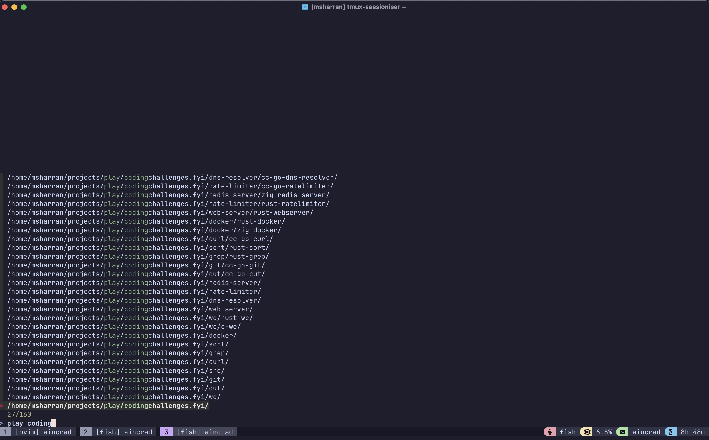
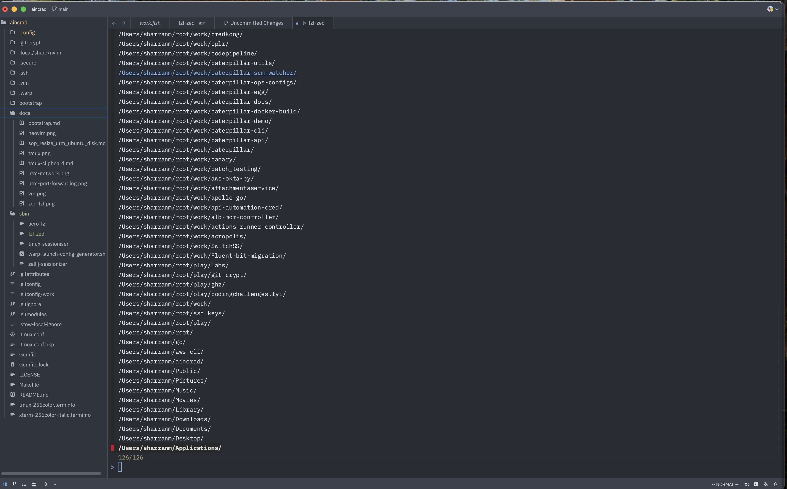

# Aincrad - My Dotfiles

This repository contains my system configurations for a Linux (Ubuntu) virtual machine running on Apple Silicon Mac. I use this setup for development, keeping MacOS as my primary OS while utilizing Linux for development tasks.

## My MacOS Subsystem for Linux 😉

I prefer MacOS for everyday applications and Apple's hardware ecosystem, but I find Linux more suitable for development work. This setup gives me the best of both worlds:

### Host-Guest Architecture
- **Host OS**: MacOS on Apple Silicon
- **Virtualization**: [UTM](https://mac.getutm.app/) (QEMU-based VM manager for Mac)
- **Guest OS**: Ubuntu ARM Server

### Development Environment
- **Code Editor**: Run Neovim and Tmux inside the VM after SSH
- **Terminal**: Ghostty
- **Window Management**: Aerospace tiling window manager





### Network Connectivity 🔗

**Drawbacks of default bridged network**
- Doesn't work properly with VPN on host - VM traffic bypasses the VPN
- Can have connectivity issues when host network configuration changes
- May expose VM directly to potentially unsecure networks

**Using Emulated VLAN with SSH Port Forwarding**
1. In UTM, set VM network to "Emulated VLAN"


2. Configure port forwarding: Host port 2022 → Guest port 22


3. Connect via `ssh vm` using the following SSH config. See [SSH Configuration](.ssh/config) for details.

```ssh
Host vm
  HostName 127.0.0.1
  Port 2022
  User msharran
  IdentityFile ~/.ssh/id_msharran
  IdentitiesOnly yes
```

This was suggested by the community in the UTM GitHub issue as a workaround for VPN issues:

> Have you tried the emulated VLAN network mode? If any, that one would definitely go through the VPN since it's emulated in userspace. The other modes use macOS Virtualization features that might not respect the host's VPN settings.
> https://github.com/utmapp/UTM/issues/3238#issuecomment-959911107

### Development Workflow 🛠️

My daily workflow is optimized for speed and efficiency:

1. **Launch Terminal**: Open Ghostty on MacOS
2. **Connect to VM**: `ssh vm` - connects instantly via port forwarding
3. **Project Switching**: Run `t` (tmux-sessionizer) to fuzzy-find and switch between projects
4. **Development**: All coding happens in the VM with Neovim, tmux, and CLI tools
5. **Host Integration**: Use MacOS apps (Aerospace, Chrome) for non-development tasks

**Key Benefits**:
- **Fast context switching**: `t` command instantly switches between projects in tmux
- **Consistent environment**: Same Linux setup regardless of MacOS changes
- **VPN compatibility**: VM traffic routes through host VPN connection
- **Resource isolation**: Heavy builds/processes don't affect MacOS performance

**Typical Development Session**:
```bash
# From MacOS terminal
ssh vm                    # Connect to development environment
t                         # Launch project selector
# Select project from fuzzy finder
# Start coding in Neovim with full Linux toolchain
```

---

## Productivity Tasks: Fast Project/Window Switching

### tmux-sessioniser (Terminal/Neovim)
If you're working in the terminal (with tmux), launch `tmux-sessioniser` (aliased as `t`) to quickly search and switch tmux sessions/projects with [fzf](https://github.com/junegunn/fzf).
This script enumerates major directories, lets you fuzzy-pick one, and attaches (or creates) a tmux session for it in a single step.

Example usage:
```bash
t              # fuzzy find and jump to a project in tmux
t ~/some/dir   # jump directly if path is provided
```
_Source: [sbin/tmux-sessioniser](sbin/tmux-sessioniser)_

---

### fzf-zed Task (Zed Editor)
Zed doesn't natively have a quick session/project switcher like tmux—so I created a similar solution using a Zed task and fzf!

- **Task Name:** `fzf-zed`
- **How to run:** Hit <kbd>Ctrl-S</kbd> (when in workspace view) to launch the task.
- **Behavior:** This spawns your custom `fzf-zed` shell command, letting you search/open projects or Zed windows in a lightning-fast way, just like the terminal workflow above but inside Zed.
- **Key binding:** Configured in [.config/zed/keymap.json](.config/zed/keymap.json).
- **Task config:** See [.config/zed/tasks.json](.config/zed/tasks.json).
- **Benefit:** Makes switching between project windows in Zed almost as fast as with tmux, supercharging multi-project development without ever leaving the keyboard.
- **Screenshot / Confirmation:**
  

If you want to adapt the core of `tmux-sessioniser` for Zed or customize project filtering, just edit your Zed `fzf-zed` script (refer to your shell scripts or automate as needed).

---

> *Note: My host git projects are primarily dotfiles*

## Quick Start

```bash
# Install Ansible on MacOS
brew install ansible

# Clone this repository
git clone https://github.com/msharran/aincrad.git
cd aincrad

# Run the playbook
cd ansible
ansible-playbook -i inventory.yml site.yml --ask-become-pass --check
ansible-playbook -i inventory.yml site.yml --ask-become-pass
```

See the [Setup Guide](#setup-guide) section below for complete instructions including UTM VM setup, prerequisites, and troubleshooting.

---

## Ansible Quick Reference

### Core Concept
Ansible is **agentless automation** - uses SSH to push configurations to target systems. No daemons required.

### Key Components
- **Inventory** - defines target hosts (YAML/INI format)
- **Playbook** - YAML files containing tasks
- **Modules** - reusable components (apt, file, service, etc.)
- **Facts** - system information gathered automatically

### Essential Commands

```bash
# Test connectivity
ansible all -i inventory.yml -m ping

# Run ad-hoc commands
ansible all -i inventory.yml -m shell -a "uptime"

# Run playbook
ansible-playbook -i inventory.yml site.yml

# Dry run (check mode)
ansible-playbook -i inventory.yml site.yml --check

# Verbose output
ansible-playbook -i inventory.yml site.yml -vvv

# Run specific tags
ansible-playbook -i inventory.yml site.yml --tags "install"
```

### How It Works
1. **Reads inventory** - identifies target hosts
2. **Gathers facts** - collects system info (OS, arch, etc.)
3. **Executes tasks** - runs modules sequentially
4. **Idempotent** - only changes what's needed
5. **Reports results** - shows changed/ok/failed status

### Your Setup
- **Inventory**: `inventory.yml` - defines VM connection (SSH port 2022)
- **Playbook**: `site.yml` - installs dev tools, configures system
- **Config**: `ansible.cfg` - SSH settings, timeouts, etc.

### Execution Flow
```bash
ansible-playbook -i inventory.yml site.yml
```
1. Connects to VM via SSH (127.0.0.1:2022)
2. Checks Ubuntu version (fails if <22.04)
3. Installs APT packages
4. Installs snaps (nvim, go, node, ghostty)
5. Installs tools (rust, zig, pyenv)
6. Configures directories and dotfiles
7. Verifies installations

Each task is **idempotent** - safe to re-run, only changes what's needed.

---

## Setup Guide

### ⚠️ Important Disclaimer

This repository contains my personal development environment configuration. Feel free to use it as inspiration, but **please don't blindly copy everything**. Review the configurations and adapt them to your needs.

### Prerequisites

Before running the Ansible playbook, you need:

#### 1. UTM VM Setup

1. **Download UTM**: Get UTM from [mac.getutm.app](https://mac.getutm.app)
2. **Download Ubuntu ARM**: Get Ubuntu Server ARM64 from [ubuntu.com](https://ubuntu.com/download/server/arm)
3. **Create VM in UTM**:
   - Architecture: ARM64
   - Memory: 8GB (or whatever your Mac can spare)
   - Storage: 64GB minimum
   - Network: **Emulated VLAN** (important for VPN compatibility)
   - Port Forwarding: Host port 2022 → Guest port 22

#### 2. Ubuntu Installation

1. **Download Ubuntu Server ARM64**: Use Ubuntu 22.04 LTS or newer (required)
2. Boot the VM and install Ubuntu Server
3. Create user: `msharran` (or modify the playbook for your username)
4. Install OpenSSH server during installation or run:
   ```bash
   sudo apt update
   sudo apt install openssh-server
   sudo systemctl enable ssh
   sudo systemctl start ssh
   ```

**Important**: The playbook requires Ubuntu 22.04 or newer and will fail on older versions.

#### 3. SSH Key Setup

1. **Generate SSH key on MacOS** (if you don't have one):
   ```bash
   ssh-keygen -t ed25519 -f ~/.ssh/id_msharran -C "your-email@example.com"
   ```

2. **Copy public key to VM**:
   ```bash
   ssh-copy-id -i ~/.ssh/id_msharran.pub -p 2022 msharran@127.0.0.1
   ```

3. **Add SSH config to `~/.ssh/config`**:
   ```ssh
   Host vm
     HostName 127.0.0.1
     Port 2022
     User msharran
     IdentityFile ~/.ssh/id_msharran
     IdentitiesOnly yes
   ```

4. **Test SSH connection**:
   ```bash
   ssh vm
   ```

### MacOS Setup (Host)

1. **Install Homebrew**:
   ```bash
   /bin/bash -c "$(curl -fsSL https://raw.githubusercontent.com/Homebrew/install/HEAD/install.sh)"
   ```

2. **Install Ansible**:
   ```bash
   brew install ansible
   ```

3. **Verify Ansible Installation**:
   ```bash
   ansible --version
   ```

### VM Provisioning

1. **Clone This Repository**:
   ```bash
   git clone https://github.com/msharran/aincrad.git
   cd aincrad
   ```

2. **Test VM Connectivity**:
   ```bash
   cd ansible
   ansible vm -i inventory.yml -m ping
   ```

3. **Run the Ansible Playbook**:
   ```bash
   ansible-playbook -i inventory.yml site.yml
   ```

The playbook will:
- Install all system dependencies (git, fish, fzf, ripgrep, etc.)
- Install development tools via snap (Neovim, Node.js, Go, Ghostty)
- Install Rust via rustup
- Install Zig (latest version)
- Install Python via pyenv
- Set up directory structure (~/go, ~/.npm-global, ~/.cargo, etc.)
- Install Starship prompt
- Set Fish as default shell
- Create project directories
- Clone and install aincrad dotfiles
- Configure npm global prefix
- Set up your complete development environment

**Note**: This process takes 10-20 minutes depending on your Mac's performance. The playbook will automatically verify Ubuntu version compatibility and install all required dependencies.

4. **Verify Installation**:
   ```bash
   ssh vm
   nvim --version
   node --version
   go version
   rustc --version
   zig version
   pyenv --version
   gcc --version
   direnv --version
   starship --version
   fish --version
   ```

All tools should be available in your PATH via the fish configuration.

### Troubleshooting

#### SSH Connection Issues
- Check VM is running in UTM
- Verify SSH service: `sudo systemctl status ssh`
- Check port forwarding in UTM settings
- Verify SSH key permissions: `chmod 600 ~/.ssh/id_msharran`

#### Ansible Connection Failed
- Test manual SSH: `ssh vm`
- Check inventory.yml has correct settings
- Verify VM IP hasn't changed
- Restart VM and try again

#### Snap Installation Issues
- Check snapd is running: `sudo systemctl status snapd`
- Install snapd if missing: `sudo apt install snapd`
- Manually install snaps: `sudo snap install nvim --classic`
- Check snap PATH: `echo $PATH | grep snap`

### Customization

#### Modify Username
Edit `ansible/site.yml` and change:
```yaml
vars:
  user_name: your-username  # Change this
```

#### Add More Software
**Add APT packages** to the `Install system dependencies` task in `site.yml`:
```yaml
- name: Install system dependencies
  apt:
    name:
      - your-package-here
```

**Add Snap packages** to the snap installation task:
```yaml
- name: Install snaps
  snap:
    name: "{{ item }}"
    classic: true
  loop:
    - nvim
    - go
    - node
    - ghostty
    - your-snap-here
```

---

This setup is inspired by [Mitchell's NixOS setup on Mac](https://x.com/mitchellh/status/1346136404682625024?s=46) and [Liz's Linux VMs article](https://medium.com/@lizrice/linux-vms-on-an-m1-based-mac-with-vscode-and-utm-d73e7cb06133).
