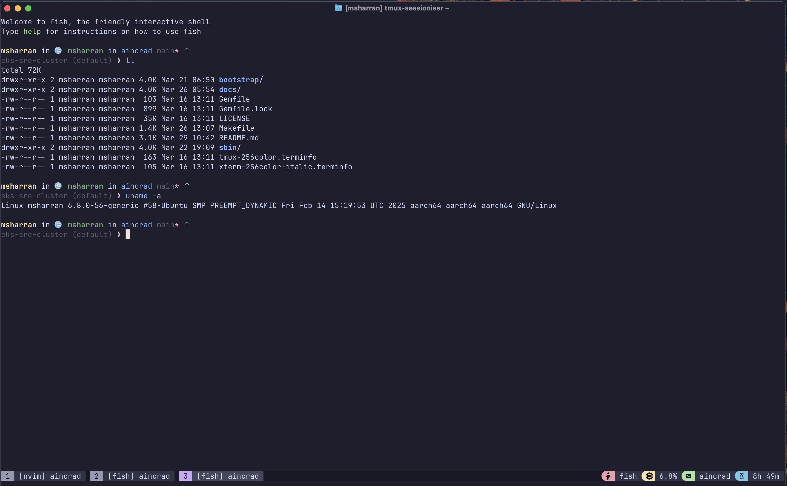
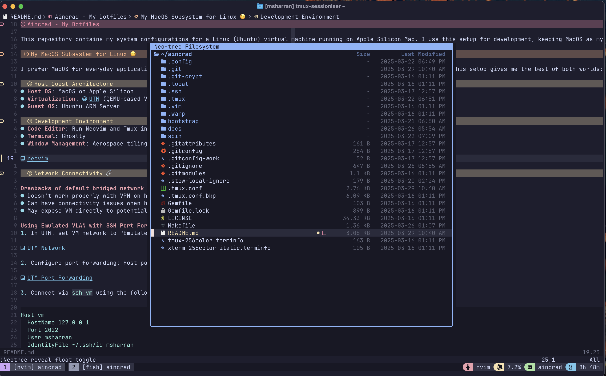

# Aincrad - My Development Environment

This repository holds the Ansible playbooks and configurations for my development setup. I run an Ubuntu VM on my Apple Silicon Mac and do all my development inside of it. This is how I get a consistent, powerful Linux environment while still using macOS as my daily driver.

I've been refining this for a while, and it's now at a point where setting up a new machine is pretty painless. This README is as much for me as it is for anyone else who finds it useful.




This setup is inspired by [Mitchell's NixOS setup on Mac](https://x.com/mitchellh/status/1346136404682625024?s=46) and [Liz's Linux VMs article](https://medium.com/@lizrice/linux-vms-on-an-m1-based-mac-with-vscode-and-utm-d73e7cb06133).

## The Philosophy

I like macOS for the hardware and the ecosystem, but for development, I just prefer Linux. This setup is my attempt to get the best of both worlds. The goal is a completely automated, replicable environment that I can spin up on any new Mac.

The secret sauce is using **UTM's "Emulated VLAN"** network mode. The default bridged mode is a pain and doesn't play well with VPNs. With an emulated VLAN and simple SSH port forwarding, all the VM's traffic goes through the host, so the VPN just works. No more headaches.

## How to Set This Up on a New Mac

Here's the process from start to finish. I've tried to make it as simple as possible.

### Step 1: Get Your Mac Ready

First, you need to install a couple of things on the host machine.

1.  **Install Homebrew**: If you don't have it already, open a terminal and run:
    ```bash
    /bin/bash -c "$(curl -fsSL https://raw.githubusercontent.com/Homebrew/install/HEAD/install.sh)"
    ```
2.  **Install Ansible**: This is what we'll use to provision the VM.
    ```bash
    brew install ansible
    ```

### Step 2: Build the VM

Now, let's create the virtual machine.

1.  **Get UTM**: Download it from [mac.getutm.app](https://mac.getutm.app).
2.  **Get Ubuntu**: You'll need the **Ubuntu Server ARM64** image. I use 22.04 LTS, and the scripts are built for it, so I'd recommend sticking with that. You can get it from the [Ubuntu website](https://ubuntu.com/download/server/arm).
3.  **Create the VM in UTM**:
    - **Architecture**: `ARM64`
    - **Memory**: At least 8GB, more if you can spare it.
    - **Storage**: 64GB is a good starting point.
    - **Network**: This is important. Set it to **`Emulated VLAN`**.
    - **Port Forwarding**: Add a rule to forward host port `2022` to guest port `22`.
4.  **Install Ubuntu**: Boot the VM and run through the Ubuntu Server installation. Make sure you create a user and **install the OpenSSH server** when prompted.

### Step 3: Set Up SSH

We need to be able to SSH into the VM without a password.

1.  **Create an SSH Key**: If you don't have one you want to use, make a new one.
    ```bash
    ssh-keygen -t ed25519 -f ~/.ssh/id_msharran
    ```
2.  **Copy the Key**: This command will copy your public key to the VM.
    ```bash
    ssh-copy-id -i ~/.ssh/id_msharran.pub -p 2022 <your_username>@127.0.0.1
    ```
3.  **Configure SSH**: Add this to your `~/.ssh/config` file on your Mac to make life easier.
    ```ssh
    Host vm
      HostName 127.0.0.1
      Port 2022
      User <your_username>
      IdentityFile ~/.ssh/id_msharran
      IdentitiesOnly yes
    ```
4.  **Test it**: Run `ssh vm`. You should log in without a password. If not, something went wrong in the steps above.

5.  **Configure GPG Key**: Import your GPG key. I have my SOP to do it in a private Google Doc.

### Step 4: Run the Ansible Playbook

This is the magic part. The playbook will install everything and set it all up.

1.  **Clone this repo**:
    ```bash
    git clone https://github.com/msharran/aincrad.git
    cd aincrad/ansible
    ```
2.  **Run the playbook**:
    Use the `Makefile` to provision your machines.
    - To provision the UTM VM, run:
      ```bash
      make utm/install
      ```
    - To provision the OrbStack VM, run:
      ```bash
      make orb/install
      ```
    The command will prompt for your GPG passphrase. The playbook is idempotent, so you can run it again without breaking anything.

    If you need to create a new OrbStack VM, you can use the `orb/create` command:
    ```bash
    make orb/create
    ```

## My Daily Workflow

My day-to-day is pretty simple and fast.

1.  I open my terminal and type `ssh vm`.
2.  I run `t` (a small script) to get a fuzzy finder over my projects. It either attaches to an existing tmux session or creates a new one.
3.  I do all my coding in the VM.

That's it. It's a super fast way to switch between projects, and my development environment stays the same no matter what I do on my Mac.

## Customizing It

If you want to adapt this for yourself, you'll need to change the username in a few places:

-   **`ansible/site.yml`**: Change the `user_name` variable.
-   **`ansible/inventory.yml`**: Change the `ansible_user` for the hosts.
-   **`ansible/Makefile`**: Change the username in the `orb/create` command.
