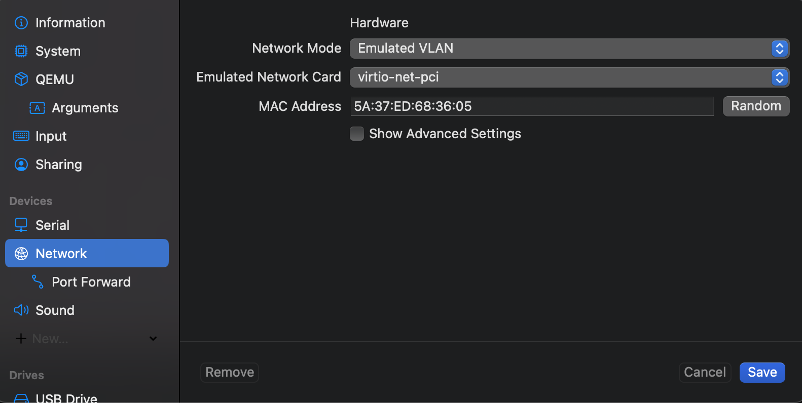
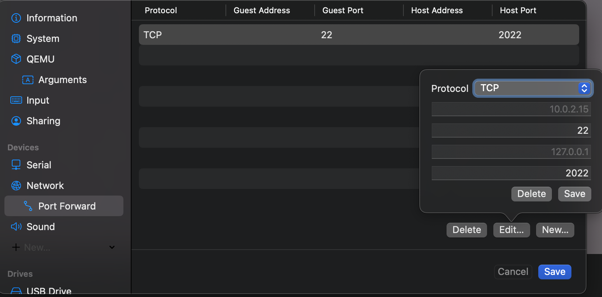

# Aincrad - My Dotfiles

This repository contains my system configurations for a Linux (Ubuntu) virtual machine running on Apple Silicon Mac. I use this setup for development, keeping MacOS as my primary OS while utilizing Linux for development tasks.

## My MacOS Subsystem for Linux 😉

I prefer MacOS for everyday applications and Apple's hardware ecosystem, but I find Linux more suitable for development work. This setup gives me the best of both worlds:

### Host-Guest Architecture
- **Host OS**: MacOS on Apple Silicon
- **Virtualization**: [UTM](https://mac.getutm.app/) (QEMU-based VM manager for Mac)
- **Guest OS**: Ubuntu ARM Server

### Development Environment
- **Code Editor**: Zed with remote development support
- **Terminal**: Ghostty
- **Window Management**: Aerospace tiling window manager


### Network Connectivity 🔗

**Drawbacks of default bridged network**
- Doesn't work properly with VPN on host - VM traffic bypasses the VPN
- Can have connectivity issues when host network configuration changes
- May expose VM directly to potentially unsecure networks

**Using Emulated VLAN with SSH Port Forwarding**
1. In UTM, set VM network to "Emulated VLAN"



2. Configure port forwarding: Host port 2022 → Guest port 22



3. Connect via `ssh vm` using the following SSH config. See [SSH Configuration](.ssh/config) for details.

```ssh
Host vm
  HostName 127.0.0.1
  Port 2022
  User msharran
  IdentityFile ~/.ssh/id_msharran
  IdentitiesOnly yes
```

This was suggested by the community in the UTM GitHub issue as a workaround for VPN issues:

> Have you tried the emulated VLAN network mode? If any, that one would definitely go through the VPN since it's emulated in userspace. The other modes use macOS Virtualization features that might not respect the host's VPN settings.
> https://github.com/utmapp/UTM/issues/3238#issuecomment-959911107

### Development Workflow 🛠️

I use Zed's remote development feature to edit files directly on the guest system from my host. This provides a native-feeling experience while working with Linux under the hood.

The custom [zed-fzf](./sbin/zed-fzf) script I created lists git projects from both host and guest systems, allowing quick access through Zed. It intelligently reuses existing windows when applicable.

> *Note: My host git projects are primarily dotfiles*

## Usage Instructions

Run the following in Host's `$HOME` directory.

> Note: My SSH keys are encrypted by `git-crypt` using my GPG key.
   
```bash
# Path to my GPG keys
export EXPORTED_GPG_ZIP=~/Downloads/sharran-gpg-20250316T104202Z-001.zip

# Clone Aincrad
git clone https://github.com/msharran/aincrad.git
cd aincrad

# Bootstrap HostOS
make host/bootstrap

# Bootstrap GuestOS
make vm/bootstrap
```

This setup is inspired by [Mitchell's NixOS setup on Mac](https://x.com/mitchellh/status/1346136404682625024?s=46) and [Liz's Linux VMs article](https://medium.com/@lizrice/linux-vms-on-an-m1-based-mac-with-vscode-and-utm-d73e7cb06133).
