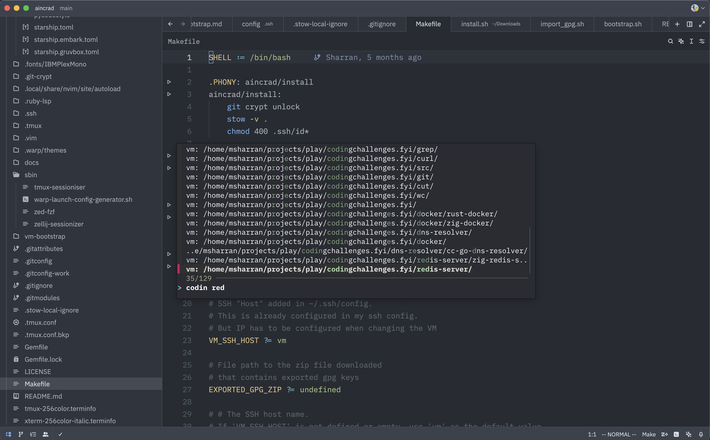

# Aincrad - My Dotfiles

This repository contains my system configurations for a Linux (Ubuntu) virtual machine running on Apple Silicon Mac. I use this setup for development, keeping MacOS as my primary OS while utilizing Linux for development tasks.

## My Workflow

I prefer MacOS for everyday applications and Apple's hardware ecosystem, but I find Linux more suitable for development work. This setup gives me the best of both worlds:

### Host-Guest Architecture
- **Host OS**: MacOS on Apple Silicon
- **Virtualization**: [UTM](https://mac.getutm.app/) (QEMU-based VM manager for Mac)
- **Guest OS**: Ubuntu ARM Server

### Development Environment
- **Code Editor**: Zed with remote development support
- **Terminal**: Ghostty
- **Window Management**: Aerospace tiling window manager



## Network Connectivity

UTM's bridged networking allows seamless communication between host and guest systems. To connect:

1. Find the guest IP address:
   ```bash
   ip -4 addr
   ```

2. Connect via SSH:
   ```bash
   ssh <guest_ip_address>
   ```

I've configured SSH to allow simple connection via `ssh vm` command. See [SSH Configuration](.ssh/config) for details.

## Development Workflow

I use Zed's remote development feature to edit files directly on the guest system from my host. This provides a native-feeling experience while working with Linux under the hood.

The custom [zed-fzf](./sbin/zed-fzf) script I created lists git projects from both host and guest systems, allowing quick access through Zed. It intelligently reuses existing windows when applicable.

> *Note: My host git projects are primarily dotfiles*

## Getting Started

1. Export the environment variable for GPG files:
   ```bash
   export EXPORTED_GPG_ZIP=~/Downloads/sharran-gpg-20250316T104202Z-001.zip
   ```

2. Run the following in Host's $HOME directory after setting up SSH connection:
   ```bash
   git clone https://github.com/msharran/aincrad.git
   cd aincrad
   make host/bootstrap
   make vm/bootstrap
   ```

This setup is inspired by [Mitchell's NixOS setup on Mac](https://x.com/mitchellh/status/1346136404682625024?s=46) and [Liz's Linux VMs article](https://medium.com/@lizrice/linux-vms-on-an-m1-based-mac-with-vscode-and-utm-d73e7cb06133).
